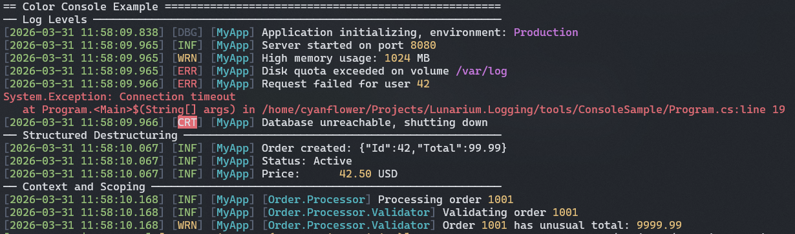

# Lunarium.Logging

[](https://github.com/Cyanflower/Lunarium.Logging/actions/workflows/ci.yml)
[](https://www.nuget.org/packages/Lunarium.Logging)
[](https://codecov.io/gh/Cyanflower/Lunarium.Logging)
[](LICENSE)

<p align="center">English | <a href="https://github.com/Cyanflower/Lunarium.Logging/blob/main/README.ZH.md">中文</a></p>

A lightweight, high-performance structured logging library for .NET — zero external dependencies, zero-allocation filter and parser hot path, ~200 ns full call path overhead, and native AOT compatible.

> Designed for developers who want structured message template logging without pulling in multiple packages or wrestling with complex sink configurations.

---

## Why Lunarium.Logging?

Many structured logging libraries split basic functionality across multiple packages — separate installs for the core, console sink, file sink, and formatters. Lunarium.Logging ships everything needed for everyday logging in a single package: console, file (with built-in rotation), and channel sinks are all included, with no external dependencies and no assembly sprawl.

Tired of complex logger configuration?
**This library was built to solve a specific, practical problem**: making multi-sink and condition-based routing **intuitive**. Isolating high-frequency modules to dedicated files, aggregating global errors into a single file, and adapting console levels for different environments — Lunarium.Logging was born to address these real production pain points. You no longer need to wrestle with complex sub-loggers, obscure filter expression languages, or piece together multiple extra packages. Here, each sink declares its own level range and context rules inline, right within the same builder chain. No separate configuration steps, no expression syntax to learn. See [Filtering & Multi-Sink Routing](#filtering--multi-sink-routing) for a concrete example.

Beyond packaging, the filter and template parser hot paths run at zero allocation (~9 ns and ~11–19 ns respectively). It integrates with `Microsoft.Extensions.Logging` as a full drop-in provider via the `Hosting` package, so adoption in an existing ASP.NET Core or Generic Host application requires no changes to how loggers are injected or used. Filter-level changes can be applied at runtime via `appsettings.json` hot-reload without restarting.

The optional extension packages (`Hosting`, `Configuration`, `Http`) are genuinely optional — the core library works on its own.

---

## Highlights

- **Simple, intuitive API** — Fluent builder, sensible defaults, no ceremony.
- **Per-sink filtering and context routing** — Each sink independently declares its level range and context-based include/exclude rules, inline in the builder chain. Route modules to dedicated files, aggregate errors separately, keep the console at a different level — all without sub-loggers or expression filter syntax.
- **Zero dependencies** — The core library is complete on its own. Console, file (with built-in rotation), and Channel sinks are all included. No extra packages required for everyday use.
- **Low-overhead hot path / zero-allocation filter and parser** — Filter cache hits at ~9 ns, template cache hits at ~11–19 ns, both at zero allocation. Full log calls run at ~186–212 ns with 128–240 B allocated, from `LogEntry` construction and `params` boxing — not from the logging infrastructure itself. See [Performance Benchmarks](#performance) for details.
- **Structured message templates** — `{Property}`, `{@Object}`, `{Value,10:F2}` syntax with alignment, formatting, and destructuring support.
- **Native AOT compatible** — First-class AOT and trimming support throughout. Register a source-generated `JsonSerializerContext` for `{@Object}` destructuring, or implement `IDestructurable`/`IDestructured` for fully reflection-free structured output.

### Console Example


---

## Packages

| Package | Description | NuGet |
|---------|-------------|-------|
| `Lunarium.Logging` | Core library — structured logging, sinks, filters | [](https://www.nuget.org/packages/Lunarium.Logging) |
| `Lunarium.Logging.Hosting` | `IHostBuilder` / `ILoggingBuilder` integration, MEL bridge (depends on `Lunarium.Logging.Configuration`) | [](https://www.nuget.org/packages/Lunarium.Logging.Hosting) |
| `Lunarium.Logging.Configuration` | `appsettings.json` integration with hot-reload support | [](https://www.nuget.org/packages/Lunarium.Logging.Configuration) |
| `Lunarium.Logging.Http` | HTTP batch sink — supports Seq (CLEF), Loki, and custom endpoints | [](https://www.nuget.org/packages/Lunarium.Logging.Http) |

---

## Quick Start

```sh
dotnet add package Lunarium.Logging
```

```csharp
using Lunarium.Logging;

ILogger logger = new LoggerBuilder()
    .SetLoggerName("MyApp")
    .AddConsoleSink()
    .AddFileSink("logs/app.log")
    .Build();

logger.Info("Server started on port {Port}", 8080);
// [2026-03-31 12:00:00.000] [INF] [MyApp] Server started on port 8080

logger.Warning("High memory usage: {UsageMB} MB", 1024);
// [2026-03-31 12:00:00.000] [WRN] [MyApp] High memory usage: 1024 MB

logger.Error(ex, "Request failed for user {UserId}", userId);
// [2026-03-31 12:00:00.000] [ERR] [MyApp] Request failed for user 42   (stderr)
// System.Exception: Connection timeout
//    at ...
```

File rotation is built in — no extra packages needed:

```csharp
// rotate daily, keep up to 30 files
new LoggerBuilder()
    .SetLoggerName("MyApp")
    .AddTimedRotatingFileSink("logs/app.log", maxFile: 30)
    .Build();

// rotate when file exceeds 50 MB
new LoggerBuilder()
    .SetLoggerName("MyApp")
    .AddSizedRotatingFileSink("logs/app.log", maxFileSizeMB: 50)
    .Build();

// combine both: size limit and daily rotation
new LoggerBuilder()
    .SetLoggerName("MyApp")
    .AddRotatingFileSink("logs/app.log", maxFileSizeMB: 50, rotateOnNewDay: true, maxFile: 30)
    .Build();
```

### Structured Destructuring

```csharp
// {@} — render as structured JSON
logger.Info("Order created: {@Order}", order);
// [2026-03-31 12:00:00.000] [INF] [MyApp] Order created: {"Id":42,"Total":99.99}

// {$} — force ToString()
logger.Info("Status: {$Status}", myEnum);
// [2026-03-31 12:00:00.000] [INF] [MyApp] Status: Active

// Alignment and formatting
logger.Info("Price: {Amount,10:F2} USD", 42.5);
// [2026-03-31 12:00:00.000] [INF] [MyApp] Price:      42.50 USD
```

### Context and Scoping

```csharp
// Attach a source context by string
ILogger orderLog = logger.ForContext("Order.Processor");
orderLog.Info("Processing order {Id}", orderId);
// [2026-03-31 12:00:00.000] [INF] [MyApp] [Order.Processor] Processing order 1001

// Or by type — uses the class name as the context string
ILogger payLog = logger.ForContext<PaymentService>();

// Chain contexts: "Order.Processor" → ForContext("Validator") = "Order.Processor.Validator"
ILogger validatorLog = orderLog.ForContext("Validator");
validatorLog.Info("Validating order {Id}", orderId);
// [2026-03-31 12:00:00.000] [INF] [MyApp] [Order.Processor.Validator] Validating order 1001
```

Use it standalone as shown above, or integrate it into ASP.NET Core / Generic Host as a full drop-in replacement for the default `Microsoft.Extensions.Logging` provider — see [Integration with Generic Host](#integration-with-generic-host).

---

## Filtering & Multi-Sink Routing

Each sink carries its own `FilterConfig` — a level range and optional context include/exclude rules. Everything is declared inline in the builder, with no separate configuration step.

```csharp
ILogger logger = new LoggerBuilder()
    .SetLoggerName("MyApp")

    // Main log — exclude the high-frequency proxy module, keep everything else
    .AddSizedRotatingFileSink(
        logFilePath: "logs/app.log", 
        maxFileSizeMB: 10, 
        maxFile: 5,
        FilterConfig: new FilterConfig
        {
            LogMinLevel = LogLevel.Info,
            ContextFilterExcludes = ["MyApp.ProxyService"],
        })

    // Dedicated file for the proxy module only
    .AddSizedRotatingFileSink(
        logFilePath: "logs/proxy.log", 
        maxFileSizeMB: 10, 
        maxFile: 10,
        FilterConfig: new FilterConfig
        {
            LogMinLevel = LogLevel.Info,
            ContextFilterIncludes = ["MyApp.ProxyService"],
        })

    // Error aggregation — all modules, Error and above only
    .AddSizedRotatingFileSink(
        logFilePath: "logs/error.log", 
        maxFileSizeMB: 10, 
        maxFile: 5,
        FilterConfig: new FilterConfig 
        { 
            LogMinLevel = LogLevel.Error 
        })

    // Console — Debug and above during development
    .AddConsoleSink(
        FilterConfig: new FilterConfig 
        { 
            LogMinLevel = LogLevel.Debug 
        })
    .Build();
```

`ContextFilterIncludes` and `ContextFilterExcludes` match by prefix, so `"MyApp.ProxyService"` catches `MyApp.ProxyService`, `MyApp.ProxyService.Handler`, and any deeper context derived from it.

For a full production example with audit logs, warning-only sinks, and a channel sink for UI broadcasting, see [Advanced Sink Configuration](example/EN/SinkConfiguration.EN.md).

---

## Integration with Generic Host

```sh
dotnet add package Lunarium.Logging.Hosting
```

```csharp
Host.CreateDefaultBuilder(args)
    .UseLunariumLog(sinks => sinks
        .AddConsoleSink()
        .AddFileSink("logs/app.log"))
    .Build()
    .Run();
```

Use `ILogger<T>` from DI as usual — Lunarium.Logging acts as the MEL provider.

---

## appsettings.json Configuration

```sh
dotnet add package Lunarium.Logging.Configuration
```

```json
{
  "LunariumLogging": {
    "GlobalConfig": {
      "TextTimestampMode": "Custom",
      "TextCustomTimestampFormat": "yyyy-MM-dd HH:mm:ss.fff"
    },
    "LoggerConfigs": [
      {
        "LoggerName": "MyApp",
        "ConsoleSinks": {
          "main-console": {
            "IsColor": true,
            "FilterConfig": {
              "LogMinLevel": "Info"
            }
          }
        },
        "FileSinks": {
          "app": {
            "LogFilePath": "Logs/app.log",
            "MaxFileSizeMB": 10.0,
            "RotateOnNewDay": true,
            "MaxFile": 30,
            "ToJson": true
          }
        }
      }
    ]
  }
}
```

Supports **hot-reload** — filter changes apply at runtime without restarting.

---

## HTTP Sinks (Seq / Loki)

```sh
dotnet add package Lunarium.Logging.Http
```

```csharp
// Seq (CLEF format)
new LoggerBuilder()
    .SetLoggerName("MyApp")
    .AddSeqSink(
        httpClient:    new HttpClient(),
        seqEndpoint:   "http://localhost:5341/api/events/raw",
        apiKey:        "your-seq-api-key")
    .Build();

// Loki
new LoggerBuilder()
    .SetLoggerName("MyApp")
    .AddLokiSink(
        httpClient:    new HttpClient(),
        lokiEndpoint:  "http://localhost:3100/loki/api/v1/push",
        labels:        new Dictionary<string, string>
        {
            ["app"]         = "my-service",
            ["environment"] = "production",
        })
    .Build();
```

Provides lightweight HTTP sinks using native HttpClient for batching logs to Seq (CLEF format) or Grafana Loki.

---

## Performance

Benchmarks run on i7-8750H, .NET 10.0, Release mode.

**Hot path (filter + parser cache hits)**

| Scenario | Time | Allocations |
|----------|------|-------------|
| Filter cache hit | ~9 ns | 0 |
| Template cache hit | ~11–19 ns | 0 |
| Full log call (no properties) | ~186 ns | 113 B |
| Full log call (5 properties) | ~212 ns | 227 B |

**Writer rendering**

| Format | Time | Allocations |
|--------|------|-------------|
| Text / Color | ~320–600 ns | 32 B |
| JSON | ~470–750 ns | 64 B |

The 32–64 B allocation in rendering is a minimal, fixed cost (related to pool management or internal struct wrapping), completely independent of the number of properties or message length. Filter and parser caches operate at strict zero allocation on the hot path.

For detailed analysis and cross-platform comparisons, see the benchmark reports:
- [Performance Analysis](BenchmarkReports/Latest/EN/PerformanceAnalysis.md)
- [Platform Differences](BenchmarkReports/Latest/EN/PlatformDifferences.md)

---

## Examples

Full annotated examples are available in the [`example/`](example/) directory, each provided as a Markdown guide and a raw C# file.

| Example | Description |
|---------|-------------|
| [Quick Start](example/EN/QuickStart.EN.md) | Log levels, exceptions, message template syntax, `ForContext` |
| [Sink Configuration](example/EN/SinkConfiguration.EN.md) | All sink types, `FilterConfig`, `ISinkConfig`, `GlobalConfigurator` |
| [Hosting Integration](example/EN/HostingIntegration.EN.md) | Generic Host, DI, MEL bridge, `UseLunariumLog` |
| [Configuration Integration](example/EN/ConfigurationIntegration.EN.md) | `appsettings.json` binding, hot-reload |
| [HTTP Sink](example/EN/HttpSink.EN.md) | Seq, Loki, custom serializers, `AddHttpSink` |
| [Advanced Usage](example/EN/AdvancedUsage.EN.md) | Custom `ILogTarget`, `IDestructurable`/`IDestructured`, AOT, `LoggerManager` |

Raw C# source files (no Markdown) are in [`example/RawCSharp/`](example/RawCSharp/).

---

## Native AOT

Lunarium.Logging is marked `IsAotCompatible=true` and passes AOT/trimming analysis at build time.

`{@Object}` destructuring relies on `JsonSerializer` under the hood. In AOT environments, register a source-generated `JsonSerializerContext` so serialization is fully reflection-free. Types not registered will silently fall back to `ToString()` — no runtime exception is thrown.

**Step 1 — declare a `JsonSerializerContext` for your types:**

```csharp
[JsonSerializable(typeof(Order))]
[JsonSerializable(typeof(UserRecord))]
[JsonSerializable(typeof(List<Order>))]
internal partial class MyAppJsonContext : JsonSerializerContext { }
```

**Step 2 — register it before calling `Build()`:**

```csharp
GlobalConfigurator.Configure()
    .UseJsonTypeInfoResolver(MyAppJsonContext.Default)
    .Apply();

// Multiple contexts can be combined:
// .UseJsonTypeInfoResolver(
//     JsonTypeInfoResolver.Combine(MyAppJsonContext.Default, AnotherContext.Default))
```

Alternatively, implement `IDestructurable` or `IDestructured` for structured output that requires no serializer at all.

---

## Requirements

- .NET 8, 9, or 10
- No external NuGet dependencies (core library)

---

## Test Coverage

776 tests across three test projects.

| Project | Tests |
|---------|------:|
| `Lunarium.Logging.Tests` | 653 |
| `Lunarium.Logging.Http.Tests` | 102 |
| `Lunarium.Logging.IntegrationTests` | 21 |

| Metric | Coverage |
|--------|--------:|
| Line | 92.1% |
| Branch | 88.8% |
| Method | 98.7% |

Per-package breakdown:

| Package | Line Coverage |
|---------|-------------:|
| `Lunarium.Logging` | 91.3% |
| `Lunarium.Logging.Hosting` | 100% |
| `Lunarium.Logging.Configuration` | 98.1% |
| `Lunarium.Logging.Http` | 92.8% |

---

## Attributions

The **Structured Message Template syntax** supported by this library, as well as its underlying abstract token model (e.g., `MessageTemplate`, `TextToken`, `PropertyToken`), are conceptually inspired by the excellent design of [Serilog](https://github.com/serilog/serilog). See [`ATTRIBUTIONS.md`](ATTRIBUTIONS.md) for full details.

---

## License

Apache 2.0 — see [LICENSE](LICENSE).
