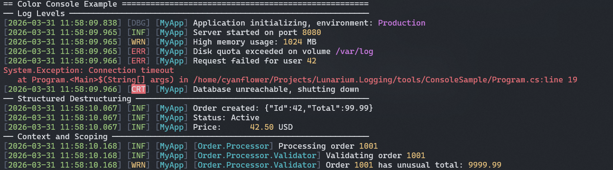

# Lunarium.Logging

[](https://github.com/Cyanflower/Lunarium.Logging/actions/workflows/ci.yml)
[](https://www.nuget.org/packages/Lunarium.Logging)
[](https://codecov.io/gh/Cyanflower/Lunarium.Logging)
[](LICENSE)

A lightweight, high-performance structured logging library for .NET — zero external dependencies, zero hot-path allocations, and native AOT compatible.

> Designed for developers who want structured message template logging without pulling in multiple packages or wrestling with complex sink configurations.

## Why Lunarium.Logging?

Many structured logging libraries split basic functionality across multiple packages — separate installs for the core, console sink, file sink, and formatters. Lunarium.Logging ships everything you need for everyday logging in a single, self-contained package with no external dependencies and no assembly sprawl. The optional extension packages (`Hosting`, `Configuration`, `Http`) are genuinely optional — the core library works on its own.

## Highlights

- **Simple, intuitive API** — Fluent builder, sensible defaults, no ceremony.
- **Per-sink filtering and context routing** — Each sink independently declares its level range and context-based include/exclude rules, inline in the builder chain. Route modules to dedicated files, aggregate errors separately, keep the console at a different level — all without sub-loggers or expression filter syntax.
- **Zero dependencies** — Console, File, and Channel sinks built in. No extra packages required for everyday use.
- **Low-overhead hot path / zero-allocation filter and parser** — Filter cache hits at ~9 ns, template cache hits at ~11–19 ns, both at zero allocation. Full log calls run at ~186–212 ns with 128–240 B allocated, from `LogEntry` construction and `params` boxing — not from the logging infrastructure itself.
- **Structured message templates** — `{Property}`, `{@Object}`, `{Value,10:F2}` syntax with alignment, formatting, and destructuring.
- **Native AOT compatible** — First-class AOT and trimming support. Register a source-generated `JsonSerializerContext` for `{@Object}` destructuring, or implement `IDestructurable`/`IDestructured` for fully reflection-free output.

## Install

```bash
dotnet add package Lunarium.Logging
```

| Package | Description |
|---------|-------------|
| [`Lunarium.Logging`](https://www.nuget.org/packages/Lunarium.Logging) | Core — Console, File, Channel sinks. No external dependencies. |
| [`Lunarium.Logging.Hosting`](https://www.nuget.org/packages/Lunarium.Logging.Hosting) | `ILogger<T>` / Generic Host / MEL integration |
| [`Lunarium.Logging.Configuration`](https://www.nuget.org/packages/Lunarium.Logging.Configuration) | `appsettings.json` with hot-reload |
| [`Lunarium.Logging.Http`](https://www.nuget.org/packages/Lunarium.Logging.Http) | HTTP batch sink — Seq, Grafana Loki, generic JSON |

## Quick Example

```csharp
using Lunarium.Logging;

ILogger logger = new LoggerBuilder()
    .SetLoggerName("MyApp")
    .AddConsoleSink()
    .Build();

logger.Info("Server started on port {Port}", 8080);
// [2026-03-31 12:00:00.000] [INF] [MyApp] Server started on port 8080

logger.Warning("High memory usage: {UsageMB} MB", 1024);
// [2026-03-31 12:00:00.000] [WRN] [MyApp] High memory usage: 1024 MB

logger.Error(ex, "Request failed for user {UserId}", userId);
// [2026-03-31 12:00:00.000] [ERR] [MyApp] Request failed for user 42   (stderr)
// System.Exception: Connection timeout
//    at ...
```



## Performance

Benchmarks on i7-8750H, .NET 10.0, Release mode.

| Scenario | Time | Allocations |
|----------|------|-------------|
| Filter cache hit | ~9 ns | 0 |
| Template cache hit | ~11–19 ns | 0 |
| Full log call (no properties) | ~186 ns | 113 B |
| Full log call (5 properties) | ~212 ns | 227 B |
| Plain text rendering | ~320–600 ns | 32 B |
| JSON rendering | ~470–750 ns | 64 B |

## Requirements

- .NET 8, 9, or 10
- No external NuGet dependencies (core library)

## Examples

Full annotated examples in [`example/`](https://github.com/Cyanflower/Lunarium.Logging/tree/main/example):

| Example | Description |
|---------|-------------|
| [Quick Start](articles/quickstart.md) | Log levels, exceptions, message template syntax, `ForContext` |
| [Sink Configuration](articles/sinks.md) | All sink types, `FilterConfig`, `ISinkConfig`, `GlobalConfigurator` |
| [Hosting Integration](articles/hosting.md) | Generic Host, DI, MEL bridge, `UseLunariumLog` |
| [appsettings.json](articles/configuration.md) | `appsettings.json` binding, hot-reload |
| [HTTP Sink](articles/http-sink.md) | Seq, Loki, custom serializers |
| [Advanced Usage](articles/advanced.md) | Custom `ILogTarget`, `IDestructurable`/`IDestructured`, AOT, `LoggerManager` |

## Attributions

The message template parsing in [`LogParser.cs`](https://github.com/Cyanflower/Lunarium.Logging/blob/main/src/Lunarium.Logging/Parser/LogParser.cs) is an original state-machine implementation, conceptually inspired by [Serilog](https://github.com/serilog/serilog). See [ATTRIBUTIONS.md](https://github.com/Cyanflower/Lunarium.Logging/blob/main/ATTRIBUTIONS.md) for details.

## License

Apache 2.0 — see [LICENSE](https://github.com/Cyanflower/Lunarium.Logging/blob/main/LICENSE).
